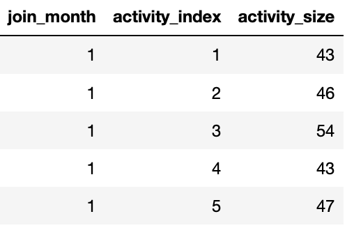

# Calculating and rendering `Range Retention` (with full code example in Python)


2/12/2019

Raphael Vannson


## Abstract
This post introduces the concept of `Range Retention`, it also provides a strategy to calculate it and a complete example of calculation via a Jupyter notebook on Github. Note: `Range Retention` is a (common) special case of `Cohort Retention` - this will make sense once you have read the next section.


## What is `Range Retention`?
### Simple question... simple answer?

Retention is an observational metric used by organizations to evaluate what fraction of their members come back after first contact. For example: brick and mortar shop owners want to know if customers come back after their first purchase, web platforms want to know if users come back after they have created an account (or their first visit), etc...

So what's the big deal I hear you ask? Sounds like retention can easily be defined as a single number given by this formula:


### Not so simple...
The problem with this definition of retention is that it is a summary over all users since the organization's first day of business. It does not say much about the organization's current ability to get its members to come back nor does it measure the (potential) effect of actions the organization has taken to improve retention. 


### `Range Retention` to the rescue!

One way to address this issue is to get more granular: instead of a single number, retention is defined as a table of multiple retention rates. This table tells the story of how multiple user groups (cohorts) retain over time - this is called `Range retention`.

How does it work? First, a period of interest is selected (ex: last 12 months), that is the period for which we are going to get our "retention story". Second, this period is broken down into smaller windwos of time (ex: weekly or monthly) - that is how we get time-granular. Finally users who appeared in our period of interest are grouped into cohorts - that is how we get the user-granular. Then all we have to do is calculate the retention rate of each user cohort for each window. 

Here is a simple example: Say our period of interest is 2018, broken down by month (our windows) and that a user cohort is the month when the user made first contact. Then `Range Retention` is going to be a table containing these retention rates: 

 * Users who made first contact in January: what proportion came back 1, 2 ... 11 months later?
 * Users who made first contact in February: what proportion came back 1, 2 ... 10 months later?
 * ...
 * Users who made first contact in November: what proportion came back 1 month later?

You can see we are about to calculate a triangular table containing interesting retention rates in the cells shaded in green and `NAs` in elsewhere.


## An approach to calculate `Range Retention`

This section details my approach to calculate the `Range Retention` table, based on an example. We will analyze orders data to get to the "retention story" of a ficticious store. Our period of interest is the year 2004, our windows are going to be monthly and a user cohort is the month when the user made first contact with the store. Note data has been filtered to retain only customers who made first contact in 2004: we want to limit our analysis to new customers.


### Raw data

Let's start with a table containing orders data for year . While all we need for our pupose is a customer ID and an order date, our raw orders data has more information and looks like this:


### The basics
Regardless of the langague you are going to use to process the data (SQL, Python, R, Scala...), ensure the data is in the right types (ex: date formats not string, etc...). In addition, make sure to create one column capturing the "window ID" (month extracted from `order_date` for our example).


### Define the cohorts

Let's assign each user to a cohort. For us the cohort ID is going to be the month of first contact so we will name our cohort ID column `joined_month` (the month the user "joined" the store).


### Get the cohort sizes

Next, we want to get the number of unique customer IDs in each cohort.

*Note while we have a cohort for month 12, we will not be reporting any retention values for it since we are looking at 12 months of data (we would need to have 13 months to report how cohort #12 is doing on month 12 + 1).*


### Update the raw data with `cohort ID` and `activity index`

The next step is to go back to the raw orders data and add a couple of useful columns to it. For each order row, we will want to add `joined_month` (based on the customer ID) and an `activity_index` (based on order date month and `joined_month`). We will filter out rows where `activity_index = 0`. The `activity_index` captures how many windows after the join date the order was placed at. Example: for a `join_month` of Janurary (`1`), then an order placed in March will have an `activity_index` of `2` (activity is 2 months after first contact).

Selecting only the columns of interest, we now have one row per order identifying which cohort (`join_month`) and how many months after joining the order was placed (`activity_index`):


### Get the number of returning customers 

Count the number of returning customers per cohort and per month:




### Calculate the `Range Retention` table

Join the counts, make a division...


...pivot, add some colors and you're done!


*Note the `0`s in the lower triangle are in fact `NA`s which have been replaced to allow for the nice cell-by-cell shading, see [this issue](https://github.com/pandas-dev/pandas/issues/14260) for details.*

## Gimme the good stuff


Wanna get hands-on and see the code? No problem! [This Notebook](https://github.com/slalom/medium-rangeretention/blob/master/notebook/range-retention.ipynb) provides an complete code example in Python. All the artifacs of this post are on this [Github repo](https://github.com/slalom/medium-rangeretention.git), feel free to clone to retreive locally with:

```bash
$ git clone https://github.com/slalom/medium-rangeretention.git
```

